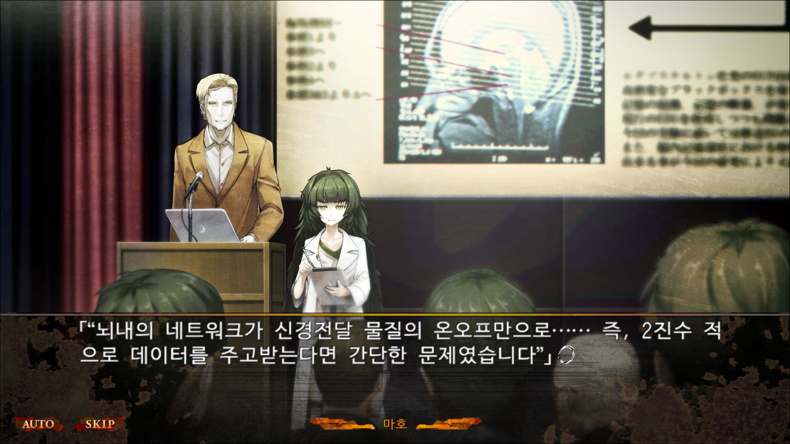

## 캡스톤 디자인 44팀 - Team AI44
Repository: [Google drive](https://drive.google.com/drive/folders/1JFq7aJPQ9kyBiYMT8CoLZcOoXJF-qCuG?usp=sharing)

### 프로젝트 소개 

AI44는 스토리 위주로 진행되는 비주얼 노벨 장르 게임으로 AI를 인간으로 만드는 것이 목표인 게임입니다.

(비주얼 노블 게임 예시)

주인공은 AI를 연구중인 대학원생으로, AI를 학습시켜 인간으로 만드는 과정에서 발생하는 주변 인물들과의 갈등, AI의 오작동 등 다양한 문제를 겪게 됩니다.

#### 저희 프로젝트는 게임의 몰입감을 위해서 기존 그래픽노블 게임들과 차별점을 두었습니다.

AI와 상호작용할 수 있는 컨텐츠를 제공합니다.

- 단순히 스토리를 따라가는것이 아닌, AI와 직접 상호작용할 수 있는 컨텐츠들을 제공함으로써 유저와 캐릭터간의 몰입에 대한 부분을 개선하고 **'인공지능은 인격체인가?'** 에 대해 유저들이 직접 생각해 볼 수 있도록 컨텐츠를 구성할 에정입니다.

감정상태에 따른 스토리의 변화가 존재합니다.

- 기존의 그래픽노블류 게임들은 유저가 선택할 수 있는 선택지들에 의해 스토리가 변화하지만, 저희는 선택지와 등장인물들의 감정상태를 스토리에 반영해 좀 더 세밀하고 다양한 스토리를 제공하도록 게임을 설계했습니다.

고 퀄리티의 이미지 리소스들을 이용해 유저가 좀 더 몰입할 수 있도록 합니다.

- 기존 그래픽 노블류 게임들은 일러스트레이터가 직접 배경, 캐릭터, UI를 디자인하기 때문에 시간과 비용이 많이 들어 높은 퀄리티의 리소스를 확보하기가 어렵다는 단점이 존재해 Stable diffusion 기반의 모델들을 이용해 높은 퀄리티의 리소스들을 확보했습니다.

  

### 개발환경

Game client: Unity(2021.3.9f1), C#  

ML models: Pytorch, Unity barracuda, ML-agent, ONNX 

Arts: Stable diffusion, Novel ai  

Repository: [Google drive](https://drive.google.com/drive/folders/1JFq7aJPQ9kyBiYMT8CoLZcOoXJF-qCuG?usp=sharing) -> 용량 문제로 인해 게임 소스파일들은 github가 아닌 구글 드라이브에 업로드 될 예정입니다.

 

### 팀 소개

| 박종한                                                  | 김정환                                                       | 문경한                                                       |
| :------------------------------------------------------ | :----------------------------------------------------------- | :----------------------------------------------------------- |
| 이미지 업로드 예정                                      | 이미지 업로드 예정                                           | 이미지 업로드 예정                                           |
| - 프로젝트 기획 - 게임 밸런싱 - 콘텐츠 디자인 | - 게임 시스템 기획 및 구현 - UI/UX 디자인 - 캐릭터 디자인 | - AI 컨텐츠 기획 - ML 모델 설계 및 구현 - 배경 디자인 |

#### 링크

##### [Github](https://github.com/kookmin-sw/capstone-2023-44)

##### [Google Drive](https://drive.google.com/drive/folders/1JFq7aJPQ9kyBiYMT8CoLZcOoXJF-qCuG?usp=sharing)

[Source file](https://drive.google.com/file/d/1NPS64jNsyXQYIj-LSsapJQsTjlR_U3vc/view?usp=sharing)

